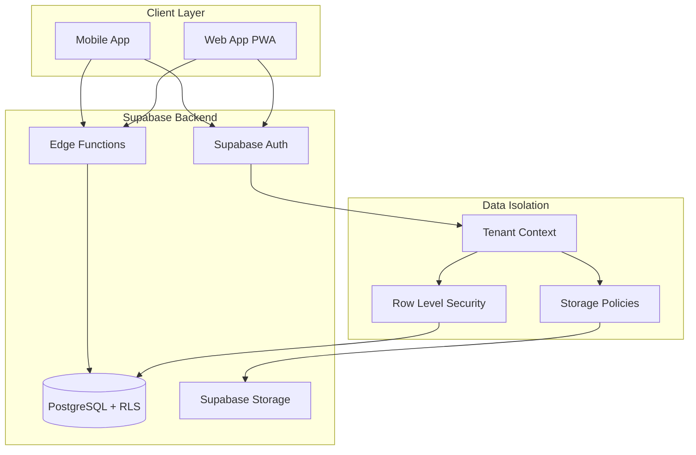
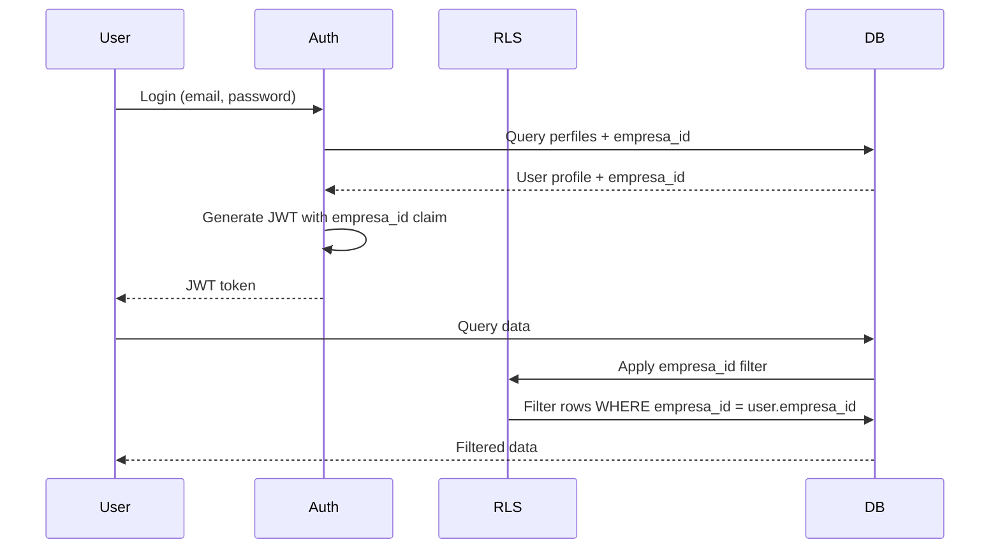
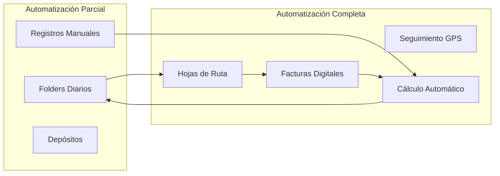
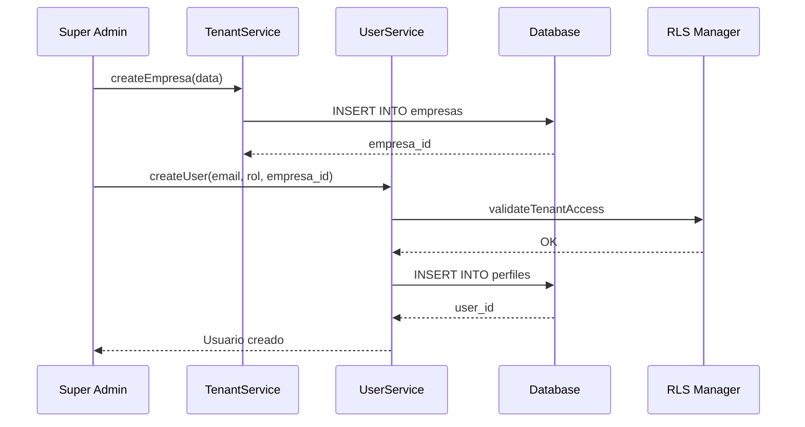

# Design Document: Multi-Tenant Platform

## Overview

La Plataforma Multi-Tenant transforma el sistema actual de cuadre automático en una arquitectura SaaS que permite a un Super Admin gestionar múltiples empresas independientes. Cada empresa opera con aislamiento completo de datos mediante Row Level Security (RLS) y tiene su propio nivel de automatización configurable.

### Key Design Decisions

**Multi-Tenancy Strategy**: Utilizamos el patrón "shared database, shared schema" con columna discriminadora `empresa_id` en todas las tablas. Esta estrategia fue seleccionada por:
- Simplicidad operacional: una sola base de datos para mantener
- Eficiencia de costos: recursos compartidos entre tenants
- RLS nativo de PostgreSQL/Supabase para aislamiento de datos
- Escalabilidad horizontal mediante sharding futuro si es necesario

**Dual Automation Levels**: El sistema soporta dos niveles de automatización por empresa:
- **Parcial**: Mantiene el sistema actual de registro manual (folders diarios, ingresos/egresos)
- **Completa**: Añade hojas de ruta digitales con seguimiento en tiempo real

Esta dualidad permite migración gradual de clientes y diferentes modelos de pricing.

**Authentication & Authorization**: Extendemos el sistema actual de autenticación de Supabase agregando:
- Tabla `empresas` para gestión de tenants
- Columna `empresa_id` en tabla `perfiles` para asociación usuario-empresa
- Rol especial `Super_Admin` con acceso cross-tenant
- Context switching para Super Admin mediante claims JWT personalizados

**Storage Isolation**: Los archivos en Supabase Storage se organizan con prefijo `{empresa_id}/` y políticas RLS que validan el tenant del usuario.

## Architecture

### System Architecture



### Multi-Tenant Data Flow



### Automation Level Architecture



## Components and Interfaces

### Core Components

#### 1. Tenant Management Service

Responsable de la gestión de empresas y contexto multi-tenant.

**Responsibilities**:
- CRUD de empresas
- Cambio de nivel de automatización
- Gestión de límites de storage
- Context switching para Super Admin

**Interface**:
```typescript
interface TenantService {
  createEmpresa(data: CreateEmpresaInput): Promise<Empresa>
  updateEmpresa(id: string, data: UpdateEmpresaInput): Promise<Empresa>
  deactivateEmpresa(id: string): Promise<void>
  reactivateEmpresa(id: string): Promise<void>
  getEmpresaStats(id: string): Promise<EmpresaStats>
  switchContext(empresaId: string): Promise<void>
}

interface CreateEmpresaInput {
  nombre: string
  nivel_automatizacion: 'parcial' | 'completa'
  logo_url?: string
  limite_storage_mb?: number
}

interface EmpresaStats {
  total_usuarios: number
  storage_usado_mb: number
  ultima_actividad: Date
  nivel_automatizacion: string
}
```

#### 2. User Management Service

Gestión de usuarios con asociación a empresas.

**Interface**:
```typescript
interface UserService {
  createUser(data: CreateUserInput): Promise<Usuario>
  updateUserRole(userId: string, rol: string): Promise<void>
  deactivateUser(userId: string): Promise<void>
  getUsersByEmpresa(empresaId: string): Promise<Usuario[]>
  validateUserAccess(userId: string, empresaId: string): Promise<boolean>
}

interface CreateUserInput {
  email: string
  password: string
  nombre: string
  rol: string
  empresa_id: string
}
```

#### 3. Digital Route Service (Automatización Completa)

Gestión de hojas de ruta digitales.

**Interface**:
```typescript
interface RouteService {
  createHojaRuta(data: CreateHojaRutaInput): Promise<HojaRuta>
  addFactura(hojaRutaId: string, factura: Factura): Promise<void>
  markFacturaEntregada(facturaId: string): Promise<void>
  markFacturaCobrada(facturaId: string, monto: MontoMultiDivisa): Promise<void>
  registerGasto(hojaRutaId: string, gasto: Gasto): Promise<void>
  calculateBalance(hojaRutaId: string): Promise<BalanceRuta>
  closeRuta(hojaRutaId: string, montoFisico: MontoMultiDivisa): Promise<void>
}

interface CreateHojaRutaInput {
  empleado_id: string
  ruta_id: string
  fecha: Date
  monto_asignado_rdp: number
  facturas: Factura[]
}

interface Factura {
  numero: string
  monto: number
  moneda: 'RD$' | 'USD'
  estado: 'pendiente' | 'pagada'
}

interface Gasto {
  tipo: 'fijo' | 'peaje' | 'combustible' | 'inesperado'
  monto: number
  moneda: 'RD$' | 'USD'
  descripcion?: string
  evidencia_requerida: boolean
}

interface BalanceRuta {
  total_facturas_rdp: number
  total_facturas_usd: number
  total_gastos_rdp: number
  total_gastos_usd: number
  dinero_disponible_rdp: number
  dinero_disponible_usd: number
}
```

#### 4. RLS Policy Manager

Gestión centralizada de políticas de seguridad.

**Interface**:
```typescript
interface RLSManager {
  applyTenantFilter(query: Query, userId: string): Query
  validateCrossTenantAccess(userId: string, targetEmpresaId: string): boolean
  getSuperAdminContext(): string | null
  auditAccessAttempt(userId: string, resource: string, allowed: boolean): void
}
```

#### 5. Storage Service

Gestión de archivos con aislamiento por tenant.

**Interface**:
```typescript
interface StorageService {
  uploadFile(empresaId: string, file: File, path: string): Promise<string>
  getFileUrl(empresaId: string, path: string): Promise<string>
  deleteFile(empresaId: string, path: string): Promise<void>
  getStorageUsage(empresaId: string): Promise<number>
  validateStorageLimit(empresaId: string, fileSize: number): Promise<boolean>
}
```

### Component Interactions



## Data Models

### New Tables

#### empresas
```sql
CREATE TABLE empresas (
  id UUID PRIMARY KEY DEFAULT gen_random_uuid(),
  nombre TEXT NOT NULL,
  nivel_automatizacion TEXT NOT NULL CHECK (nivel_automatizacion IN ('parcial', 'completa')),
  logo_url TEXT,
  activa BOOLEAN DEFAULT TRUE,
  limite_storage_mb INT DEFAULT 1000,
  created_at TIMESTAMPTZ DEFAULT NOW(),
  updated_at TIMESTAMPTZ DEFAULT NOW()
);
```

#### hojas_ruta (Automatización Completa)
```sql
CREATE TABLE hojas_ruta (
  id UUID PRIMARY KEY DEFAULT gen_random_uuid(),
  empresa_id UUID NOT NULL REFERENCES empresas(id),
  empleado_id UUID NOT NULL REFERENCES empleados(id),
  ruta_id UUID NOT NULL REFERENCES rutas(id),
  fecha DATE NOT NULL,
  identificador TEXT NOT NULL, -- "Jose Bani 20/03/2026"
  monto_asignado_rdp NUMERIC(12,2) DEFAULT 0,
  estado TEXT NOT NULL CHECK (estado IN ('pendiente', 'en_progreso', 'completada', 'cerrada')),
  cerrada_por UUID REFERENCES perfiles(id),
  cerrada_en TIMESTAMPTZ,
  created_at TIMESTAMPTZ DEFAULT NOW(),
  updated_at TIMESTAMPTZ DEFAULT NOW(),
  UNIQUE(empresa_id, identificador)
);
```

#### facturas_ruta
```sql
CREATE TABLE facturas_ruta (
  id UUID PRIMARY KEY DEFAULT gen_random_uuid(),
  hoja_ruta_id UUID NOT NULL REFERENCES hojas_ruta(id) ON DELETE CASCADE,
  numero TEXT NOT NULL,
  monto NUMERIC(12,2) NOT NULL,
  moneda TEXT NOT NULL CHECK (moneda IN ('RD$', 'USD')),
  estado_pago TEXT NOT NULL CHECK (estado_pago IN ('pendiente', 'pagada')),
  estado_entrega TEXT NOT NULL CHECK (estado_entrega IN ('pendiente', 'entregada')),
  monto_cobrado NUMERIC(12,2),
  moneda_cobrada TEXT CHECK (moneda_cobrada IN ('RD$', 'USD')),
  entregada_en TIMESTAMPTZ,
  cobrada_en TIMESTAMPTZ,
  created_at TIMESTAMPTZ DEFAULT NOW(),
  updated_at TIMESTAMPTZ DEFAULT NOW()
);
```

#### gastos_ruta
```sql
CREATE TABLE gastos_ruta (
  id UUID PRIMARY KEY DEFAULT gen_random_uuid(),
  hoja_ruta_id UUID NOT NULL REFERENCES hojas_ruta(id) ON DELETE CASCADE,
  tipo TEXT NOT NULL CHECK (tipo IN ('fijo', 'peaje', 'combustible', 'inesperado')),
  descripcion TEXT,
  monto NUMERIC(12,2) NOT NULL,
  moneda TEXT NOT NULL CHECK (moneda IN ('RD$', 'USD')),
  evidencia_requerida BOOLEAN NOT NULL,
  evidencia_id UUID REFERENCES evidencias(id),
  registrado_en TIMESTAMPTZ DEFAULT NOW(),
  created_at TIMESTAMPTZ DEFAULT NOW()
);
```

#### balance_ruta_historico
```sql
CREATE TABLE balance_ruta_historico (
  id UUID PRIMARY KEY DEFAULT gen_random_uuid(),
  hoja_ruta_id UUID NOT NULL REFERENCES hojas_ruta(id) ON DELETE CASCADE,
  total_facturas_rdp NUMERIC(12,2) NOT NULL,
  total_facturas_usd NUMERIC(12,2) NOT NULL,
  total_gastos_rdp NUMERIC(12,2) NOT NULL,
  total_gastos_usd NUMERIC(12,2) NOT NULL,
  dinero_disponible_rdp NUMERIC(12,2) NOT NULL,
  dinero_disponible_usd NUMERIC(12,2) NOT NULL,
  timestamp TIMESTAMPTZ DEFAULT NOW()
);
```

#### audit_logs
```sql
CREATE TABLE audit_logs (
  id UUID PRIMARY KEY DEFAULT gen_random_uuid(),
  empresa_id UUID REFERENCES empresas(id),
  usuario_id UUID REFERENCES perfiles(id),
  accion TEXT NOT NULL,
  recurso TEXT NOT NULL,
  detalles JSONB,
  ip_address INET,
  user_agent TEXT,
  exitoso BOOLEAN NOT NULL,
  created_at TIMESTAMPTZ DEFAULT NOW()
);

CREATE INDEX idx_audit_logs_empresa ON audit_logs(empresa_id);
CREATE INDEX idx_audit_logs_usuario ON audit_logs(usuario_id);
CREATE INDEX idx_audit_logs_created_at ON audit_logs(created_at);
```

### Modified Tables

Todas las tablas existentes requieren agregar columna `empresa_id`:

```sql
-- Agregar empresa_id a tablas existentes
ALTER TABLE perfiles ADD COLUMN empresa_id UUID REFERENCES empresas(id);
ALTER TABLE empleados ADD COLUMN empresa_id UUID REFERENCES empresas(id);
ALTER TABLE rutas ADD COLUMN empresa_id UUID REFERENCES empresas(id);
ALTER TABLE conceptos ADD COLUMN empresa_id UUID REFERENCES empresas(id);
ALTER TABLE semanas_laborales ADD COLUMN empresa_id UUID REFERENCES empresas(id);
ALTER TABLE folders_diarios ADD COLUMN empresa_id UUID REFERENCES empresas(id);
ALTER TABLE registros ADD COLUMN empresa_id UUID REFERENCES empresas(id);
ALTER TABLE depositos ADD COLUMN empresa_id UUID REFERENCES empresas(id);
ALTER TABLE evidencias ADD COLUMN empresa_id UUID REFERENCES empresas(id);

-- Crear índices para empresa_id
CREATE INDEX idx_perfiles_empresa ON perfiles(empresa_id);
CREATE INDEX idx_empleados_empresa ON empleados(empresa_id);
CREATE INDEX idx_rutas_empresa ON rutas(empresa_id);
CREATE INDEX idx_conceptos_empresa ON conceptos(empresa_id);
CREATE INDEX idx_semanas_empresa ON semanas_laborales(empresa_id);
CREATE INDEX idx_folders_empresa ON folders_diarios(empresa_id);
CREATE INDEX idx_registros_empresa ON registros(empresa_id);
CREATE INDEX idx_depositos_empresa ON depositos(empresa_id);
CREATE INDEX idx_evidencias_empresa ON evidencias(empresa_id);

-- Actualizar constraints de unicidad para incluir empresa_id
ALTER TABLE empleados DROP CONSTRAINT IF EXISTS empleados_nombre_apellido_key;
ALTER TABLE empleados ADD CONSTRAINT empleados_nombre_apellido_empresa_key 
  UNIQUE(empresa_id, nombre, apellido);

ALTER TABLE rutas DROP CONSTRAINT IF EXISTS rutas_nombre_key;
ALTER TABLE rutas ADD CONSTRAINT rutas_nombre_empresa_key 
  UNIQUE(empresa_id, nombre);

ALTER TABLE conceptos DROP CONSTRAINT IF EXISTS conceptos_descripcion_key;
ALTER TABLE conceptos ADD CONSTRAINT conceptos_descripcion_empresa_key 
  UNIQUE(empresa_id, descripcion);

ALTER TABLE folders_diarios DROP CONSTRAINT IF EXISTS folders_diarios_fecha_laboral_key;
ALTER TABLE folders_diarios ADD CONSTRAINT folders_diarios_fecha_empresa_key 
  UNIQUE(empresa_id, fecha_laboral);
```

### Updated Roles

```sql
-- Actualizar check constraint de roles en perfiles
ALTER TABLE perfiles DROP CONSTRAINT IF EXISTS perfiles_rol_check;
ALTER TABLE perfiles ADD CONSTRAINT perfiles_rol_check 
  CHECK (rol IN (
    'Super_Admin',
    'Usuario_Ingresos', 
    'Usuario_Egresos', 
    'Usuario_Completo',
    'Dueño',
    'Encargado_Almacén',
    'Secretaria',
    'Empleado_Ruta'
  ));
```

### TypeScript Interfaces

```typescript
export interface Empresa {
  id: string
  nombre: string
  nivel_automatizacion: 'parcial' | 'completa'
  logo_url?: string
  activa: boolean
  limite_storage_mb: number
  created_at: string
  updated_at: string
}

export interface HojaRuta {
  id: string
  empresa_id: string
  empleado_id: string
  ruta_id: string
  fecha: string
  identificador: string
  monto_asignado_rdp: number
  estado: 'pendiente' | 'en_progreso' | 'completada' | 'cerrada'
  cerrada_por?: string
  cerrada_en?: string
  created_at: string
  updated_at: string
}

export interface FacturaRuta {
  id: string
  hoja_ruta_id: string
  numero: string
  monto: number
  moneda: 'RD$' | 'USD'
  estado_pago: 'pendiente' | 'pagada'
  estado_entrega: 'pendiente' | 'entregada'
  monto_cobrado?: number
  moneda_cobrada?: 'RD$' | 'USD'
  entregada_en?: string
  cobrada_en?: string
}

export interface GastoRuta {
  id: string
  hoja_ruta_id: string
  tipo: 'fijo' | 'peaje' | 'combustible' | 'inesperado'
  descripcion?: string
  monto: number
  moneda: 'RD$' | 'USD'
  evidencia_requerida: boolean
  evidencia_id?: string
  registrado_en: string
}

export interface BalanceRuta {
  total_facturas_rdp: number
  total_facturas_usd: number
  total_gastos_rdp: number
  total_gastos_usd: number
  dinero_disponible_rdp: number
  dinero_disponible_usd: number
}

export interface AuditLog {
  id: string
  empresa_id?: string
  usuario_id?: string
  accion: string
  recurso: string
  detalles?: Record<string, any>
  ip_address?: string
  user_agent?: string
  exitoso: boolean
  created_at: string
}

// Actualizar Perfil para incluir empresa_id y nuevos roles
export interface Perfil {
  id: string
  empresa_id: string
  nombre: string
  rol: 'Super_Admin' | 'Usuario_Ingresos' | 'Usuario_Egresos' | 'Usuario_Completo' | 
        'Dueño' | 'Encargado_Almacén' | 'Secretaria' | 'Empleado_Ruta'
  intentos_fallidos: number
  bloqueado_hasta: string | null
}
```

